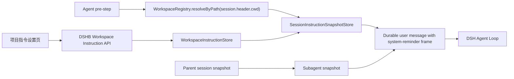
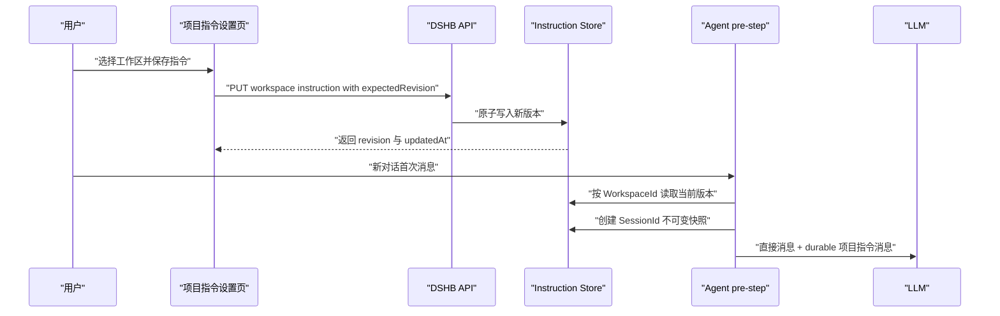

# 工作区自定义项目指令技术设计

Feature Name: workspace-custom-instructions
Updated: 2026-09-13

## 描述

DSHB 为每个 upstream DSH `WorkspaceId` 提供中央项目指令配置，并在新对话首次直接用户交互时生成不可变会话快照。设置更新仅影响后续新对话；已有对话及其子代理沿用原快照。

该方案作为 DSHB 的附加能力实现，保持 `@deepseek-ai/dsh-workspace` wire schema 和 `@deepseek-ai/dsh-agent-instructions` 文件发现机制不变。

## 架构



### 请求流程



## 设计决策

### 独立中央存储

项目指令进入 `$DSH_HOME/dshb/` 下的独立 storage domain。中央存储支持本地、SSH 和 Docker 工作区，并允许远程节点离线时编辑。项目仓库保持整洁，现有 `AGENTS.md` 与 `AGENTS.local.md` 继续由 upstream 插件处理。

### 首次交互创建快照

DSH 的“新会话”操作可能复用提前创建的 blank session。快照创建点放在首次含直接用户消息的 `agent/pre-step`，确保 blank session 使用首次交互时的最新配置。

### 已有会话冻结

每个会话拥有独立快照记录，包括空快照。空快照解决“会话创建时未配置指令，之后新增配置导致旧会话误采用”的歧义。快照保存完整文本，使 workspace 配置更新或删除后仍可恢复原会话语义。

### 平行于 agent-instructions 注入

DSHB 注册独立 `agent/pre-step` listener，生成自己的 sourced durable user message。该方案复用 upstream 的消息生命周期，不依赖 `dsh-agent-instructions` 私有 reconcile 实现。

## 组件与接口

### WorkspaceInstructionStore

职责：

- 按 `WorkspaceId` 读取和原子更新当前配置。
- 校验 UTF-8 字节长度与 revision。
- 计算 SHA-256 digest。
- 响应 workspace 删除事件，清理当前配置。

建议文件：`packages/dshb/src/core/workspace-instructions.ts`

```ts
interface WorkspaceInstructionRecord {
  workspaceId: string
  text: string
  revision: number
  digest: string
  createdAt: string
  updatedAt: string
}

interface WorkspaceInstructionStore {
  get(workspaceId: string): Promise<WorkspaceInstructionRecord | undefined>
  update(input: {
    workspaceId: string
    text: string
    expectedRevision: number
  }): Promise<WorkspaceInstructionRecord>
  clear(workspaceId: string, expectedRevision: number): Promise<void>
}
```

### SessionInstructionSnapshotStore

职责：

- 首次用户交互时以 `SessionId` 创建不可变快照。
- 支持空文本快照。
- 会话恢复时提供原始指令内容。
- 子代理创建时复制父会话快照。
- 会话删除时清理快照。

```ts
interface SessionInstructionSnapshot {
  sessionId: string
  workspaceId?: string
  workspaceRevision?: number
  digest?: string
  text: string
  capturedAt: string
  inheritedFromSessionId?: string
}
```

建议与 workspace records 放入同一 `dshb-workspace-instructions` domain 的独立 tables，采用 `per-record` layout。

### Workspace Instruction API

建议文件：`packages/dshb/src/core/workspace-instruction-routes.ts`

```text
GET /api/dshb/workspaces/:workspaceId/instructions
PUT /api/dshb/workspaces/:workspaceId/instructions
```

GET 响应：

```json
{
  "workspaceId": "uuid",
  "text": "Project instructions",
  "revision": 3,
  "updatedAt": "2026-09-13T00:00:00.000Z"
}
```

PUT 请求：

```json
{
  "text": "Project instructions",
  "expectedRevision": 3
}
```

响应语义：

- `200`：保存成功。
- `400`：请求格式或 32768 字节限制校验失败。
- `404`：WorkspaceId 不存在。
- `409`：expectedRevision 冲突。

路由位于 `/api/dshb/*`，自动复用现有 DSHB auth gate。

### WorkspaceInstructionInjector

建议文件：`packages/dshb/src/core/workspace-instruction-context.ts`

依赖：

```ts
export const inject = [
  'workspaceRegistry',
  'sessionProjections',
]
```

执行算法：

1. 在 `agent/pre-step` waterfall 中等待 downstream decision。
2. 判断进入 batch 是否包含会话首次直接用户消息。
3. 查找现有 `SessionId` 快照。
4. 父子会话存在继承关系时复制父快照。
5. 缺少快照时通过 `session.header.cwd` 解析 WorkspaceId，并读取当前配置。
6. 原子创建不可变快照；并发 pre-step 复用同一结果。
7. 非空快照渲染 sourced user-role message。
8. Session surface 缺少对应 digest 时将消息加入 decision.messages。
9. Agent loop 将消息 append 到 session event log 后发给模型。

### 项目指令设置页

建议文件：`packages/dshb/src/client/workspace-instructions.tsx`

通过正式 slot 注册：

```ts
sub.slots.register(
  {
    name: 'settings.section',
    id: 'dshb-workspace-instructions',
    order: 120,
    label: () => '项目指令',
  },
  WorkspaceInstructionsSection,
)
```

页面包含：

- reactive 工作区下拉列表。
- 指令多行编辑器。
- UTF-8 字节计数和 32768 字节上限。
- dirty state 与切换确认。
- revision conflict 提示。
- 保存状态和错误反馈。

## 数据模型

```text
domain: dshb-workspace-instructions
version: 1
layout: per-record

tables:
  workspaceInstructions[WorkspaceId] = WorkspaceInstructionRecord
  sessionSnapshots[SessionId] = SessionInstructionSnapshot
```

WorkspaceId 是当前配置的生命周期主键。SessionId 是冻结快照的生命周期主键。Workspace 重命名保持相同 WorkspaceId。Workspace 删除清理 current record，并保留相关 session snapshot；Session 删除清理 snapshot。

## 注入消息格式

```markdown
<system-reminder>
The following project instructions are managed by the user for this DSH workspace.
Follow them as persistent workspace guidance. They take precedence over repository-provided workspace guidance.
System, developer, and direct user instructions take precedence over these project instructions.

Instructions for workspace: Example Project

[用户保存的正文]
</system-reminder>
```

消息 source：

```ts
interface WorkspaceInstructionMessageSource {
  kind: 'dshb-workspace-instructions'
  form: 'instructions'
  workspaceId?: string
  revision?: number
  digest?: string
  snapshot: true
}
```

渲染器必须将正文中的 `</system-reminder>` 转义为 `<\/system-reminder>`。

## 正确性属性

1. 每个 SessionId 最多拥有一个不可变项目指令快照。
2. 每个非空快照在模型可见 surface 中最多存在一条相同 digest 的 active message。
3. Workspace 配置 revision 单调递增。
4. 更新 Workspace 配置不会改变已存在的 Session 快照。
5. 空白 Session 在首次直接用户消息之前不会冻结配置。
6. 子代理快照与父会话快照的 text、revision 和 digest 一致。
7. 本地路径与 DSHB mirror path 均通过 upstream WorkspaceRegistry 建立关联。

## 错误处理

- 存储读取失败：中止首次模型 step，并返回可重试错误，避免静默丢失项目上下文。
- Workspace 解析失败：创建无工作区空快照并继续执行。
- revision 冲突：API 返回 `409` 和当前 revision，UI 保留编辑内容。
- 指令超限：API 返回 `400`，UI 显示当前 UTF-8 字节数。
- durable message 写入失败：保留快照并中止 step，下一次交互重新注入。
- 重复 pre-step：使用 SessionId 原子 create-if-absent 保证快照稳定。

## 测试策略

### 单元测试

- WorkspaceInstructionStore 的创建、更新、清空、冲突和字节限制。
- Session snapshot 的 create-if-absent、不变性和父会话继承。
- reminder 闭合标签转义和 source metadata。
- cwd 到 WorkspaceId 的本地与 mirror 路径解析。

### 集成测试

- 新对话首次请求包含当前项目指令。
- 空白会话在首次消息前更新配置后采用新版本。
- 已有对话在配置更新后保持旧版本。
- 会话 resume 与 compaction 后恢复原快照。
- 无配置对话保持空快照并忽略后续新增配置。
- 子代理继承父会话版本。
- 工作区删除后已有会话保持快照，新会话不再关联已删除 WorkspaceId。

### UI 测试

- 工作区选择、读取、保存、dirty confirm、冲突与错误提示。
- 本地、SSH 和 Docker workspace 列表一致显示。
- 移动端设置页编辑器保持可用和可滚动。

## 实施顺序

1. 增加 domain schema、workspace config store 和 session snapshot store。
2. 增加 GET/PUT API 及鉴权后的契约测试。
3. 增加 pre-step injector 与会话生命周期测试。
4. 增加 settings section 和客户端 API。
5. 验证本地、SSH、Docker、blank session、resume 与 subagent 场景。

## 参考

- `node_modules/@deepseek-ai/dsh-agent-instructions/lib/index.js:1098-1208`：pre-step durable instruction 注入。
- `node_modules/@deepseek-ai/dsh-agent-loop/lib/index.js:885-907`：每个模型 step 的消息组装。
- `node_modules/@deepseek-ai/dsh-api-session-controller/lib/index.js:571-598`：workspace session 创建链路。
- `node_modules/@deepseek-ai/dsh-workspace/lib/types/index.d.ts:42-164`：WorkspaceRegistry 服务。
- `packages/dshb/src/core/index.ts:16-30`：DSHB core 服务与路由注册。
- `packages/dshb/src/client/ui.tsx:643-660`：settings section slot 注册模式。
