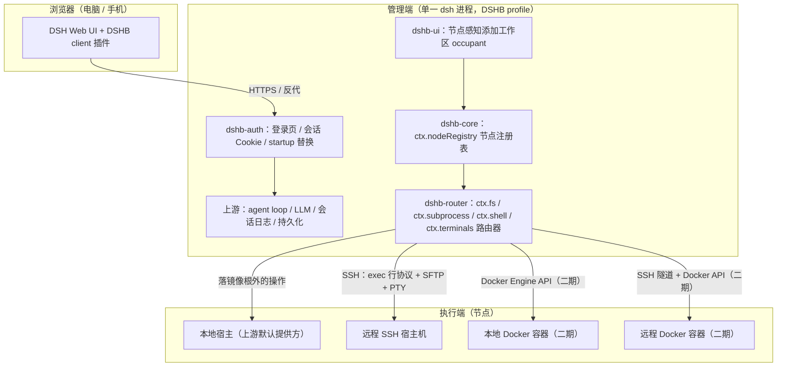
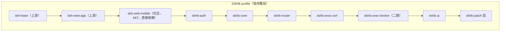

# DSH-HoneyBee（DSHB）技术设计

Feature Name: dsh-honeybee
Updated: 2026-09-03

## Description

DSHB 是基于 deepseek-harness（DSH）的多节点 Agent 工作台，以纯插件形式交付：管理端为单一 DSH 进程（自定义 profile 组合 dsh-base + dsh-web-app + DSHB 各 bundle），集中承载 agent loop、LLM 调用、会话日志与 Web UI；执行端为节点环境（本地宿主 / 本地容器 / 远程 SSH / 远程容器），仅承载工具层执行。会话通过"镜像路径 + 执行世界路由器"绑定到节点：每个远程工作区在管理端持有一个本地镜像目录，会话 cwd 使用镜像路径以满足上游 workspace 注册表的本地 realpath 校验，路由器把镜像根下的 fs / subprocess / shell / terminal 操作翻译到节点侧执行。单用户认证；连接一律由管理端发起。

## Architecture

### 总体架构



### 关键机制：镜像路径与路由

借鉴 `@bit-ark/dsh-remote` 与 `UynajGI/dsh-ssh` 均已验证的方案，DSHB 采用镜像路径消除上游 workspace 的本地 realpath 冲突：

```mermaid
sequenceDiagram
    participant U as 用户
    participant OCC as 添加工作区 occupant
    participant REG as 节点注册表
    participant WS as 上游 workspace 注册表
    participant RT as 执行世界路由器
    participant ND as 节点

    U->>OCC: 点击添加工作区
    OCC->>REG: 列出节点
    U->>OCC: 选定节点
    OCC->>ND: 浏览 / 创建远端目录
    U->>OCC: 选定路径
    OCC->>OCC: 创建本地镜像目录 mirrors/nodeId/slug
    OCC->>WS: create(镜像路径)
    WS-->>OCC: realpath 校验通过，工作区注册
    OCC->>REG: 落盘工作区绑定（镜像路径 → 节点 + 远端路径）
    U->>Loop: 在该工作区新建会话（cwd = 镜像路径）
    Loop->>RT: 工具调用（cwd / 路径在镜像根下）
    RT->>ND: 翻译为节点侧真实路径并执行
```

### 插件包结构



patch 层的三处替换（官方 cordis.patch.yml 机制，零上游源码修改）：

| 目标行 | 操作 | 目的 |
|---|---|---|
| `dsh-web-app/startup` | 按 id 替换 | 放开非回环绑定并接入认证（dsh-web-startup-auth 已验证） |
| dsh-base 的 `fs-sandbox` / `subprocess` / `bash-sandbox` | 按 id 禁用 + 插入 dshb-router | 插入执行世界路由器，本地行为经继承链保留 |
| `dsh-host-directory-picker-auto` | 按 id 禁用 + 插入 dshb-ui occupant | 添加工作区流程改为"先选节点再选路径" |

## Components and Interfaces

### dshb-auth（管理端认证）

- **Host 侧**：替换 startup 行以允许 `--host 0.0.0.0`；注册 `/api/auth/*` 路由（register / login / logout / change-password）；认证中间件保护 `/api/*`、第三方 RPC 路由与 WebSocket 握手；登录限速（同 IP 连续 5 次失败锁 30 秒）；`auth-reset` CLI 子命令。
- **回环判定**：仅依据 TCP 对端地址 + Host 头；不采信 `X-Forwarded-For`。
- **特权 API 放行**：认证通过后将 Host/Origin 改写为回环再交下游，覆盖全部注册路由与升级握手（含先于本插件激活的第三方路由）。
- **前端兼容层**：经 `webServer.tapIndex` 注入脚本，在 connection 插件激活返回时将 `connection.isLoopback` 覆盖为 `true`，保证远程浏览器下 settings mirror 正常渲染。
- **Client 侧**：登录/注册页（与 DSH 视觉一致）+ 设置面板"认证"页（退出登录 / 改用户名 / 改密码）。

### dshb-core（节点注册表）

- 新增 `ctx.nodeRegistry` 服务：`create` / `update` / `remove` / `list` / `get` / `test` / `status`。
- 秘密字段（密码 / 私钥内容）写入上游 credentials 服务（GrantRecord，0600），档案仅存引用与 `hasSecret` 标识；API 响应只回传存在性标识。
- TOFU 主机密钥库：`known_hosts.json`（0600），指纹变更拒绝连接。
- `~/.ssh/config` 解析导入（别名、User、Port、IdentityFile、ProxyJump）。
- 健康检测：按需检测 + 结果缓存，状态进入节点列表响应。

### dshb-router（执行世界路由器）

- 三个路由器类继承上游本地实现：`RouterFileSystem extends SandboxedFileSystem`、`RouterSubprocess extends LocalSubprocessRuntime`、`RouterShell extends SandboxBashExecutor`；终端后端同步提供。
- 路由判定为纯函数：`resolveWorld(path) -> WorldRef`，命中某工作区镜像根则返回对应节点世界，否则透传本地上游实现（含写围栏与沙箱语义）。
- 世界提供方接口（各节点类型实现同一接口）：

```ts
interface ExecutionWorldProvider {
  readonly nodeId: string
  fs: FileSystemProvider           // 远端语义实现
  subprocess: SubprocessProvider   // spawn / collect / pipe / waitForExit
  shell: ShellExecutor             // bash 语义
  terminal: TerminalBackend        // PTY：create / resize / kill
  ensureDir(remotePath: string): Promise<void>
  testConnection(): Promise<TestReport>
}
```

- 断连语义：路由到故障节点的调用返回分类错误（连接 / 认证 / 主机密钥 / 超时），错误经工具结果进入会话流并呈现在 UI；连接恢复后同一会话可继续。

### dshb-exec-ssh（远程 SSH 世界，一期）

- 传输：ssh2；单连接复用 exec / SFTP / PTY 通道；支持密码 / 私钥（路径或 PEM）/ passphrase / ssh-agent / ProxyJump 多跳。
- 命令协议（吸收 @bit-ark/dsh-remote 安全模型）：exec 命令串为静态字面量 runner；argv / 环境变量 / cwd 编码为逐字段单行 base64 行协议（`.` 结束行）写入 stdin，远端 runner 还原后 `exec "$@"`；远端需 bash 与 base64（兼容 bash 3.2 与 BSD base64）。
- 文件操作：SFTP 协议级（读 / 原子写 / 列目录 / stat / mkdir / 删除），不进 shell。
- 远端登录环境净化：`env -i` 启动，剔除 `DSH_*` 与凭据形变量名。
- rg 自举：探测远端 `rg`，缺失时经 SFTP 上传管理端自带的 ripgrep 二进制。
- 协议固有限制（接受并文档化）：拿不到远端 pid、无法进程树级强杀、`inspectForeground` 不可用、断连需重连机制恢复。

### dshb-exec-docker（容器世界，二期）

- 本地容器：Docker Engine API（`node:http` 直连 socket，参照 dsh-worlds 零依赖实现）。
- 远程容器：经 SSH 通道转发到远端 Docker socket / `docker` CLI。
- 执行语义：`docker exec` 承载命令与 PTY；文件经 `docker cp` 或 exec + tar 流；LSP / Bash / 终端随 seam 自动迁入。
- 镜像基线：容器内需 bash / ps / base64，缺失时自动用 apk / apt 补齐，补齐失败则明确报错。

### dshb-ui（节点感知添加工作区 + 节点管理）

- directoryFlow slot occupant：第一步节点选择（注册表节点 + 本地宿主入口），第二步节点内目录浏览（`list` / `createDirectory` 动词转发到目标节点），容器节点额外提供"已存在容器 / 新建容器（自定义镜像）"选项。
- 供给流水线（二期，新建容器）：拉取镜像 → 创建容器 → 等待就绪（healthcheck 或首次 exec 成功）→ 容器内创建工作区路径 → 注册工作区；任一阶段失败报告阶段与原因并清理半成品容器。
- 节点管理设置页：节点 CRUD、连接测试、健康状态、`~/.ssh/config` 导入。
- 侧栏工作区标题含节点归属标识。
- 移动端样式遵循 dsh-web-mobile 范式（抽屉 / 底部浮层），DSHB 新增 UI 在 <768px 下可用。

## Data Models

### 节点档案（`$DSH_HOME/dshb/nodes.json`，0600）

```ts
interface NodeProfile {
  id: string                    // nanoid
  name: string
  type: 'local-host' | 'local-docker' | 'remote-ssh' | 'remote-docker'
  ssh?: {
    host: string; port: number; username: string
    auth: { kind: 'password' | 'key' | 'agent'; credentialId?: string; keyPath?: string; passphraseId?: string }
    jump?: Array<{ host: string; port?: number; username?: string; credentialId?: string }>
    hostKeyFingerprint?: string  // TOFU 记录
  }
  docker?: {                    // local-docker / remote-docker
    mode: 'existing' | 'managed'
    containerId?: string         // existing
    image?: string               // managed：自定义镜像
    resources?: { cpus?: number; memoryMB?: number }
  }
  createdAt: string; updatedAt: string
}
```

### 工作区绑定（`$DSH_HOME/dshb/workspace-bindings.json`，0600）

```ts
interface WorkspaceBinding {
  mirrorPath: string   // 本地镜像目录 realpath，与上游 workspace 路径一致
  nodeId: string       // local-host 工作区无绑定记录
  remotePath: string   // 节点侧真实路径（容器节点为容器内路径）
  workspaceId: string  // 上游 workspace 注册表 id
}
```

### 会话凭据与会话

- 管理端认证凭据：`$DSH_HOME/dshb/web-auth.json`（0600）——scrypt（随机盐，64 字节）密码散列 + HMAC-SHA256 会话签名密钥；Cookie 14 天有效，HttpOnly。
- 节点秘密：上游 credentials 服务 GrantRecord（0600），档案仅存 `credentialId`。
- 审计日志：`$DSH_HOME/dshb/audit.log`——时间、节点、操作类型（exec / write / remove / move / provision）、结果。

## Correctness Properties

1. **镜像唯一性**：任意两条工作区绑定的 `mirrorPath` 互不相同；同一（节点，远端路径）组合至多存在一条绑定。
2. **路由完备性**：会话 cwd 位于某镜像根下时，该会话的 fs / subprocess / shell / terminal 操作全部路由到绑定节点；镜像根外的路径行为与上游本地实现逐字节一致。
3. **模型视角一致**：远程会话中模型可见的文件 displayPath 与命令工作目录为节点侧真实路径。
4. **凭据不出管理端**：节点秘密与模型 API 凭据仅存在于管理端凭据服务；任何 API 响应只含存在性标识。
5. **日志集中**：每一条会话的完整事件日志（含远程执行的工具结果）持久化于管理端。
6. **本地零回归**：本地宿主工作区会话的行为（含沙箱与写围栏）与未安装 DSHB 的上游一致。
7. **供给原子性**：新建容器工作区要么完整注册成功，要么清理全部中间产物并报告失败阶段。
8. **注入隔离**：经 SSH 下发的命令中，用户可控数据（argv / 环境 / cwd）只出现在 stdin 数据通道，命令串保持静态字面量。

## Error Handling

| 场景 | 策略 |
|---|---|
| 节点连接失败 | 分类错误（认证 / 网络 / 主机密钥 / 超时）+ 排查提示；工具结果携带可读信息进入会话 |
| 主机密钥变更 | 拒绝连接并提示中间人风险；管理员确认后经节点管理页重置指纹 |
| 会话运行中断连 | 会话内呈现节点故障；自动重连（指数退避，上限 5 次）；恢复后会话可继续，日志记录中断区间 |
| 远端缺 bash / base64 / rg | bash 与 base64 缺失则节点判定不可用并明示；rg 缺失时自动上传，上传失败仅降级 glob/grep 工具 |
| 供给流水线失败 | 报告失败阶段；删除已建容器与镜像拉取锁；绑定记录不落盘 |
| 认证连续失败 | 同 IP 5 次失败锁 30 秒；auth-reset 轮换密钥作废全部会话 |
| 上游升级破坏 | 锁版本范围 + 升级流程（重建契约 → 快照/e2e → 修编译）；patch 目标行变更时启动即报错并提示 |

## Test Strategy

- **纯函数单测**：路由判定（`resolveWorld`）、路径映射、行协议编解码、节点档案冲突判定、`~/.ssh/config` 解析。
- **提供方 live 测试**：SSH 世界对真实 sshd（含 ProxyJump 两跳）、Docker 世界对真实 daemon，覆盖 fs 全方法 / collect / PTY / 树终止。
- **契约测试**：patch 目标行 id 在上游构建产物中的存在性断言，上游升级时第一发现点。
- **Web 快照**：桌面 1280px 与移动 375px 双视口基线，覆盖登录页、节点选择、目录浏览、会话页。
- **e2e**：注册登录 → 添加 SSH 节点 → 添加远程工作区（含自动建目录）→ 新建会话执行命令 → 断言远端生效与日志集中。
- **安全回归**：命令注入用例（argv 含 shell 元字符）、凭据不出现于任何响应体、特权 API 在非回环 Host 下的放行仅在认证后。

## References

[^1]: (Website) - [DSH 架构文档：profile/bundle/patch 与 capability seam](https://github.com/deepseek-ai/deepseek-harness/blob/master/docs/architecture.md)
[^2]: (Website) - [@bit-ark/dsh-remote：镜像路径 + 路由继承 + SSH 安全协议参照](https://www.npmjs.com/package/@bit-ark/dsh-remote)
[^3]: (Website) - [UynajGI/dsh-ssh：SSH seam 家族实现参照（MIT）](https://github.com/UynajGI/dsh-ssh)
[^4]: (Website) - [frozo-ai/dsh-worlds：Docker 执行世界零依赖实现参照（MIT）](https://github.com/frozo-ai/dsh-worlds)
[^5]: (Website) - [GHJIVHIDD/dsh-plugin-container：容器供给与治理模式参照（Apache-2.0）](https://github.com/GHJIVHIDD/dsh-plugin-container)
[^6]: (Website) - [GDWhisper/dsh-web-startup-auth：认证与回环兼容层参照（MIT）](https://github.com/GDWhisper/dsh-web-startup-auth)
[^7]: (Website) - [mexiaosqwq/dsh-web-mobile：移动端适配直接依赖（MIT）](https://github.com/mexiaosqwq/dsh-web-mobile)
[^8]: (Website) - [tiphareth0/dsh-sshworkspaces：工作区↔节点绑定交互流程参照（BSD-3）](https://github.com/tiphareth0/dsh-sshworkspaces)
